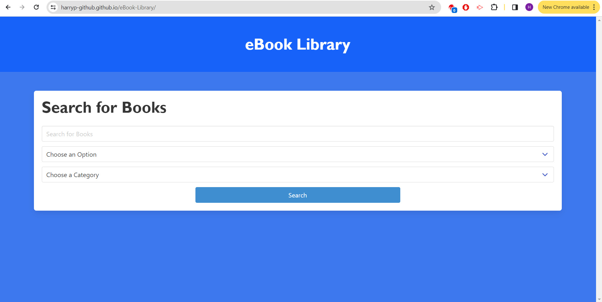
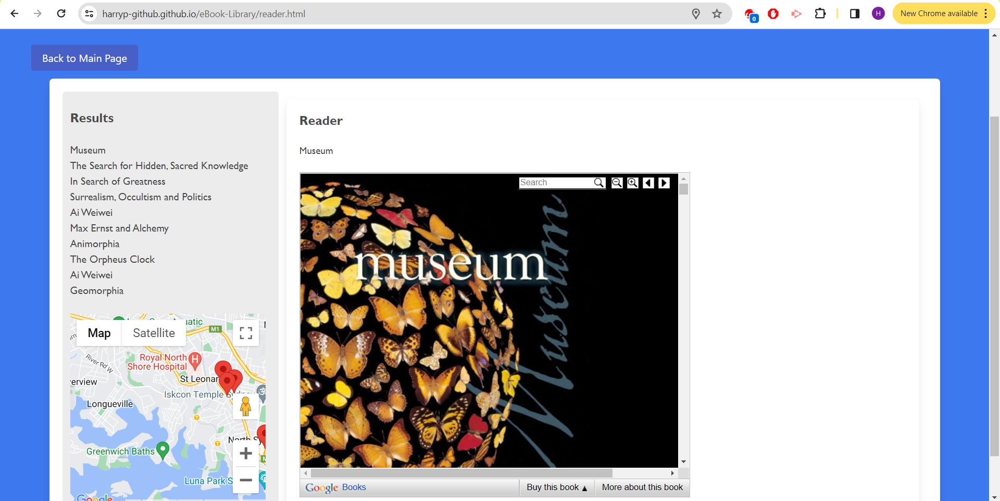

# eBook Library

## Description

This project was to create an application that would solve a real-world problem by using server-side API requests. In this project, we made an eBook Library to allow the user to search for a book and view it in the reader using the Google Books API and the see user's local bookstores on a map using the Google Maps API. The eBook Library uses the CSS framework Bulma to provide design to the HTML structure. By utilising local storage, the project has opportunity to grow by adding features that can use the local storage from the user's input. 

## Installation

N/A

## Usage

To use this application begin by searching for a book that the user would like to view. The user can use additional Options and Categories to add to their search. Once the user has searched using their input, the results will load up on the next page showing different options the user can choose to read from. Additionally the user will be prompted to allow access to their location so the map can appear with local bookstores nearby. From the results list, the user can select a book which can be viewed in the reader. Depending on screensize, be sure to adjust the zoom so the user can see the full page of their desired book.
The user can click 'Back to Main Page' to be taken back to the search page to find a new book. View the local store to see what the user has searched for.

## Credits

Andrii Medvediev

Harry Potter

Internet and Teacher/Class Resources

Google Books API: https://developers.google.com/books

Google Maps API (Provided by Tom Szentirmay): https://developers.google.com/maps/

Bulma: https://bulma.io/

## License

N/A

## Deployed Website Link

[Deployed Application](https://harryp-github.github.io/eBook-Library/)

[GitHub Repository](https://github.com/HarryP-GitHub/eBook-Library)

## Deployed Website Image

